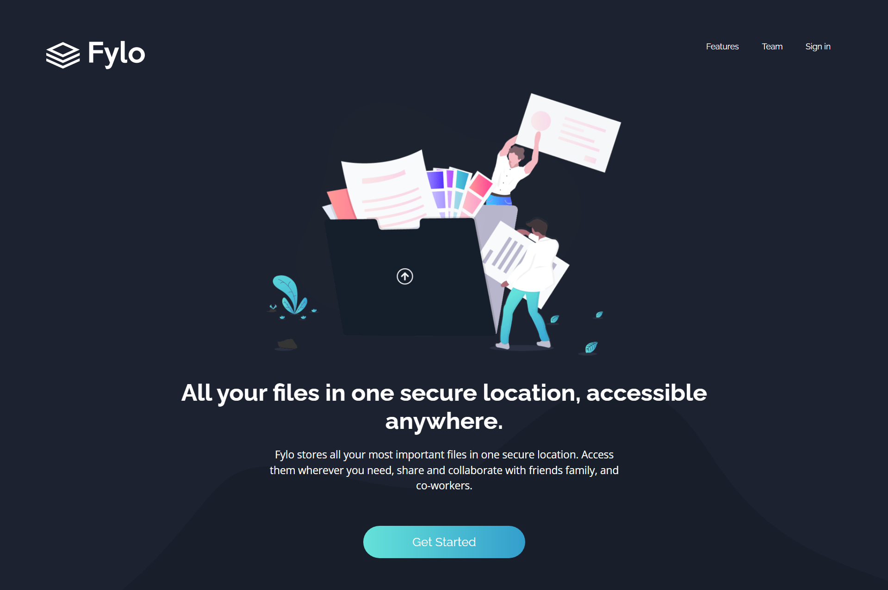

# Frontend Mentor - Fylo dark theme landing page solution

This is a solution to the [Fylo dark theme landing page challenge on Frontend Mentor](https://www.frontendmentor.io/challenges/fylo-dark-theme-landing-page-5ca5f2d21e82137ec91a50fd).

## Table of contents

- [Overview](#overview)
  - [The challenge](#the-challenge)
  - [Screenshot](#screenshot)
  - [Links](#links)
- [My process](#my-process)
  - [Built with](#built-with)
  - [What I learned](#what-i-learned)
- [Author](#author)

## Overview

### The Challenge

Your users should be able to:

- View the optimal layout for the site depending on their device's screen size
- See hover states for all interactive elements on the page

### Screenshot

### Links

- Solution URL: [Click here](https://www.frontendmentor.io/solutions/fylo-dark-theme-landing-page-1BhkCp5Ia)
- Live Site URL: [Click here](https://flyo-dark-theme-landing-page-khaki.vercel.app/)

## My process

### Built with

- Sementic HTML5 markup
- CSS custom properties
- Bootstrap

### What I learned

When developing this project I learnt how to use Bootstrap classes in a project. That's the major thing I learned from this project.

## Author

- Website - [SLGPlay](https://www.slgplay.net)
- Frontend Mentor - [@T-Induwara](https://www.frontendmentor.io/profile/T-Induwara)
- Github - [@T-Induwara](https://github.com/T-Induwara)
- LinkedIn - [@t-induwara](https://www.linkedin.com/in/t-induwara/)
